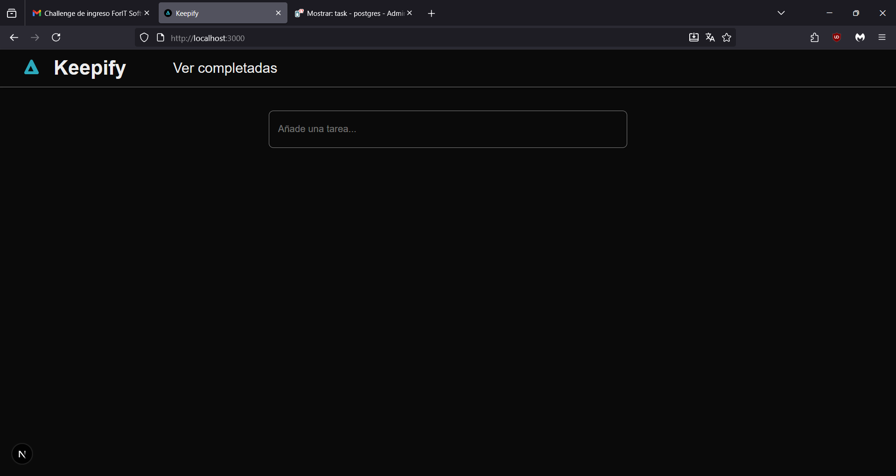
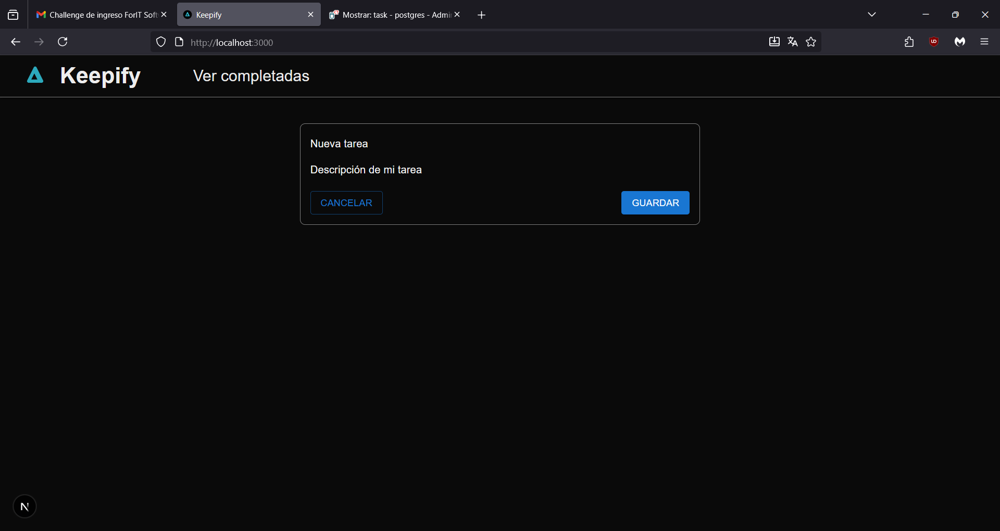
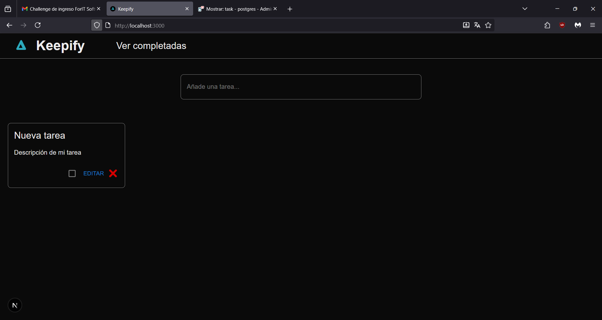
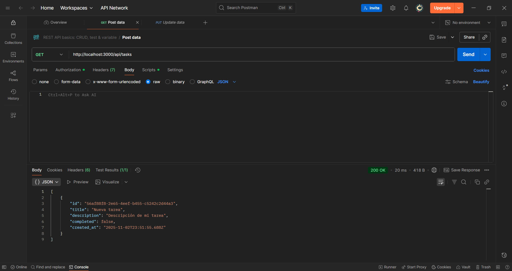
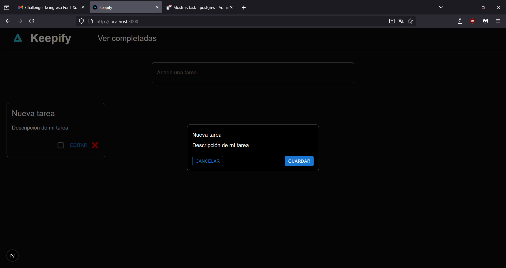
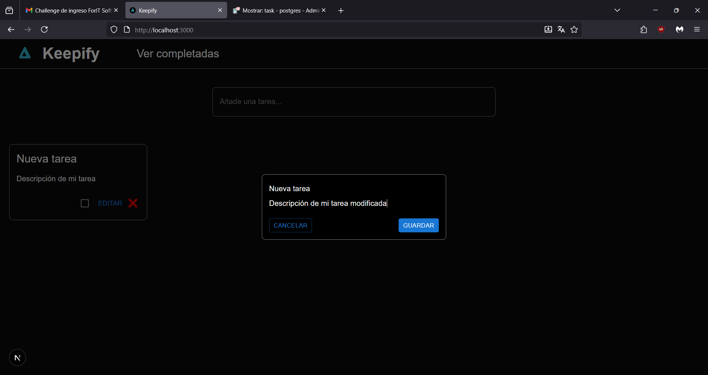
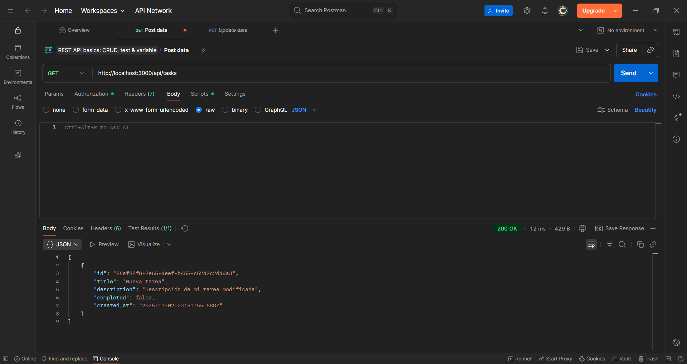
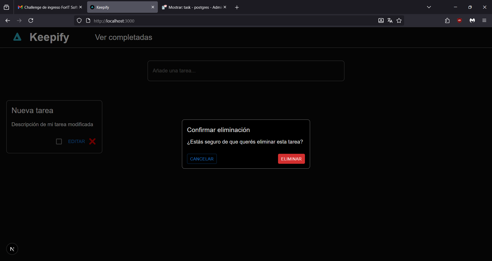
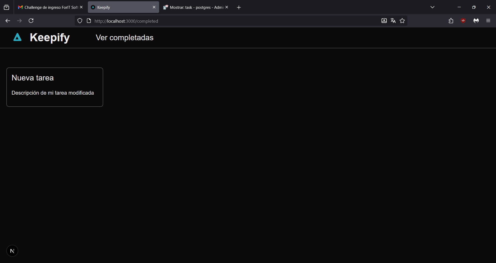

# Instrucciones para visualizar el proyecto

**En WSL, ejecutar los siguientes comandos:**

1. Clonar el repositorio:
   ```bash
   git clone git@github.com:emanuelcabral8/challenge-for-it.git

2. Dirigirse a la carpeta creada
    ```bash
    cd challenge-for-it

3. Instalar las dependencias
     ```bash
     pnpm install

4. Con docker abierto, ejecutar el siguiente comando
     ```bash
    docker compose up -d     

5. Hacer una migración de prisma
     ```bash
     pnpm prisma migrate dev init

6. Iniciar el servidor de desarrollo
    ```bash
    pnpm dev
    










    

